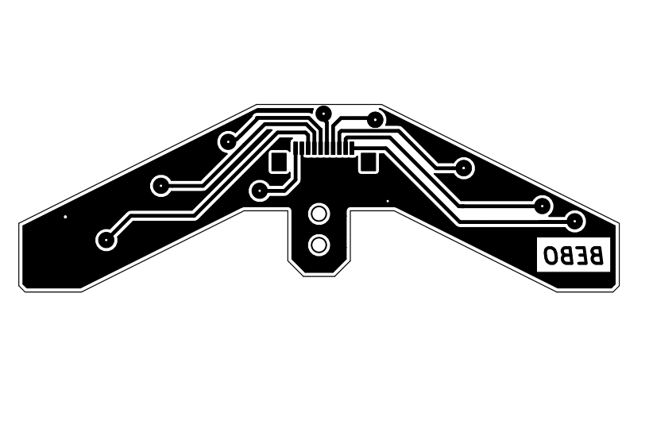

# Linefollowers

# Abstract 
Current repository contains three of my line follower projects.
Linefollower is a mobile robot which follows the line.
My robots were built for competitions so the main aim was to allow them to move fast.
Some of them were also remote controlled.
I've created these robots from top to bottom myself it means that I designed a board, created it, solder elements, create program for CPU and install it.

# Technologies
- KiCad
- STM32CubeMX
- Qt

# Description
As I mentioned current directory contains three robots
- BEBO - my first line follower which has PID algorithm
- LFANT - line follower which has spread encoders and mesure his speed
- Remote Controlled - this one is controlled by desktop remote app
To create these robots I had to do the same steps which I described below.

## Hardware
First I have to design a board. I've used a KiCad application to do it.
During this process I had to choose a CPU, engines, bridge for engine, battery, line sensors and all necessary elements.
I have chosen CPU STM32F051C8Tx because is enough small, 2 Pololu 10:1 engines, TB6612 bridge, Li-Pol 7,4V battery, line sensor KTIR0711s and depending on project AS5048A encoders or HC-06 bluetooth module.
Below you can see what it looks like designed boards ready to create.

In the next step I have to create this board and solder elements.
All

## Software
For creating software I decided to use the STM32CubeMX application.
It allows you to create programs for STM processors easily.
I assigned all necessary pins to the processor and created a controlled program.
When I finished programming it, I installed a program on robots by programator located on the STM32F4 board.
Created connection looks like below.

Ready robot looks like below.

# Desktop application
For a remote controlled robot I created a program in C++ Qt. 
The connection works through bluetooth. Program works below.
The main window of the program is split vertically.
On the left side you can see measurements from the line follower.
On the right you have a control panel.
If each sensor detects a black line the circle of the top will change to black.
Below grey rectangles you can see 0. When a robot is moving it shows speed in mps.
In the control panel you have 5 buttons.
The one on the top change remote controlling to automatic control by PID algorithm,
The next four allow remote control robots. 

